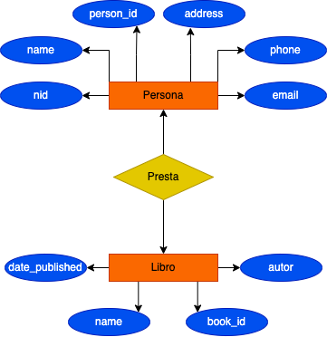
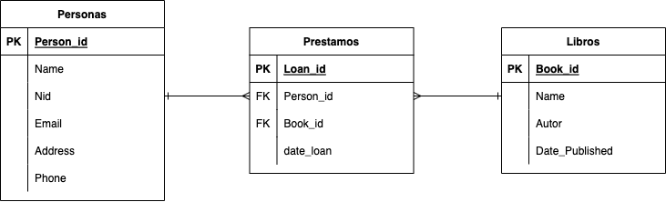

# Cuestionario Base de datos

1. **¿Qué es la redundancia de datos?**
Consiste en tener partes predecibles a partir del resto de datos, que por lo tanto no aportan nueva información o su almacenamiento seria innecesario.
    * Espacio de almacenamiento desperdiciado
    * Actualización de datos más dificil
    * Conducirá a una incosistencia de datos
    * Recuperación de datos es lenta e ineficaz
2. **¿Qué es la incosistencia de datos?**
Consiste en la diferencia de información  sobre un objeto o persona en particular en diferentes instancias.
3. **2 BD entre Consistencia y Tolerancia al particionamiento**
Prioriza la consistencia de datos sacraficando la disponibilidad del sistema
    * MongoDb
    * HBase
4. **Qué signfica SQL**
Structured Query Language
5. **Qué es la Primary Key**
En bd relaciones la PK es una columna o grupo de columnas que identifica entre todo el conjunto de datos dicha fila.
6. **Qué es la Foreign Key**
En bd relaciones la FK es una columna o grupo de columnas que permite vincular los datos almacenados entre dos tablas diferentes.
7. **Explique la Relación 1:1**
Permite que un solo registro de una tabla se relacione con un único registro de otra tabla.
8. **Explique la Relación 1:n**
Permite que un solo registro de una tabla se asocie con uno o varios registros de otra tabla, por lo tanto la pk de una tabla se enlazará a la fk de otra tabla.
9. **Explique la Relación n:n**
Permite que uno o varios registros de una tabla se relacionen con uno o varios registros de otra tabla, comunmente para esta relación se hace uso de una tabla intermedia, que almacena las llaves primarias de las dos tablas que se relacionaran como claves foreaneas.
10. **Qué es una Base de Datos**
Es la recopilación organizada de información o datos estructurados, que normalmente se almacena de forma electrónica. Normalmente una bd está controlada por un sistema de gestion de base de datos DBMS.
11. **Definir el concepto de atributo**
Es una caracteristica o rasgo de un tipo de entidad que describe la entidad.

## Diagram Entity Relationship (Biblioteca)

### DER 1

### DER 2

