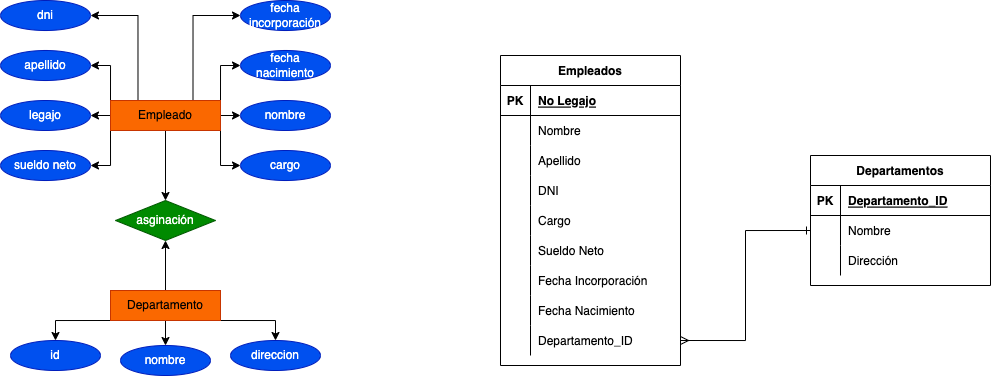

# Actividad Practica

1. **Cuál es la PK para la tabla empleados**
El No de legajo, ya que este valor debe servir como identificado unico y exclusivo del empleado dentro de la empresa
2. **Cuál es la PK para la tabla departamentos**
El ID departamentos, ya que sera el identificador en la tabla
3. **¿Qué relación/es existirían entre las tablas? ¿En qué tabla debería haber foreign key? ¿A qué campo de qué tabla hace referencia dicha foreign key?**
Es posible que cada empleado pertenezca a un departamento especifico por lo tanto cada registro de la tabla empleados haga referencia a la PK de la tabla departamentos para su columna departamento_id del empleado.

## DER

