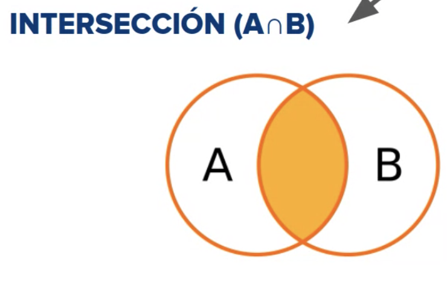

# Consultas SQL II (DML)

## JOIN

Consiste en combinar datos de una tabla con datos de otra tabla a partir de una o varaias condiciones en común.

### INNER



* *el Full Join es muy poco usado por su alto consumo de recursos*

```sql
SELECT mo.* ac.first_name, ac.last_name
FROM movies mo
INNER JOIN actors ac
ON mod.id = ac.favorite_movie_id
```

Recuperamos la información completa de la pelicula que cada actor tiene como favorita.

### RIGHT JOIN

Nos devulve todas las columnas de la tabla 1 y los registros que cumplan la condicion de la tabla 2.

```sql
SELECT mo.* ac.first_name, ac.last_name
FROM movies mo
RIGHT JOIN actors ac
ON mod.id = ac.favorite_movie_id
```

Recuperamos todas las peliculas sin importar si ningun actor la tiene como favorita.

### LEFT JOIN

Nos devulve todas las columnas de la tabla 2 y los registros que cumplan la condicion de la tabla 1.

```sql
SELECT mo.* ac.first_name, ac.last_name
FROM movies mo
LEFT JOIN actors ac
ON mod.id = ac.favorite_movie_id
```

Recuperamos tods los actores sin importar si alguno no tiene pelicula favorita.

## GROUP BY

Herramienta para agrupadosegún las columnas indicadas, genera un solo registro por cada grupo de filas que compartan las columnas indicadas, reduce la cantidad de filas de la consutla, se utilizan en conjunto con funciones de agregación para obtener datos resumidos y agrupados.

```sql
SELECT count(*) AS tot_act, mo.title, mo.rating, mo.awards 
FROM movies mo
INNER JOIN actors ac
ON mo.id = ac.favorite_movie_id
GROUP BY title;
```

Nos retorna la cantidad de veces que una pelicula se encuentra como favorita dentro de la tabla de actores.

## Having

Similar al WHERE, pero enlugar de afectar las filas de tabla afecta a los grupos generados por GROUP BY.

```sql
SELECT count(*) AS tot_act, mo.title, mo.rating, mo.awards 
FROM movies mo
INNER JOIN actors ac
ON mo.id = ac.favorite_movie_id
GROUP BY title
HAVING tot_act > 2;
```

Nos retorna la cantidad de veces que una pelicula se encuentra como favorita dentro de la tabla de actores si esa cantidad es mayor a 2.

```sql
SELECT awards, count(*)
FROM movies 
WHERE rating > 8
GROUP BY awards
HAVING awards > 2
ORDER BY awards DESC;
```

Nos retorna las peliculas con rating mayor a 8, agrupa las peliculas por awards y filtra por quienes tiene mas de 2 awards y ordena descendentemente.

## SUBQUERY

Es una sentencia SSELECT que aparece dentro de otra sentencia SELECT.

```sql
SELECT *
FROM actor_movie
WHERE movie_id IN (SELECT id FROM movies WHERE rating=9.0)
```

Nos retorna las filas que se encuentra la tabla actor_movie, que tenga un rating 9.0.

## Buenas Practicas

* Validar que el campo por el cual el hago JOIN sea del mismo tipo.
* Revisar alias en los JOINS para evitar porductos cartesianos en las consultas.
* Evitar el uso excesivo de JOINS.
* Evitar el uso de subqueries enla tablas de gran volumen que no utilicen algún indice.
* Reescribir la consulta validando los JOINS, FIlTROS, a veces es mejor un DISTINCT en lugar de un GROUP BY.
