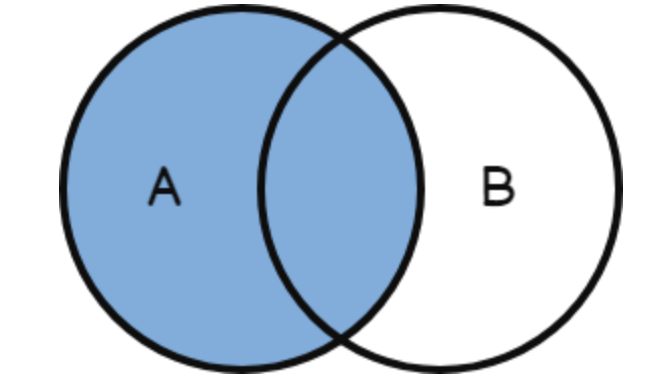
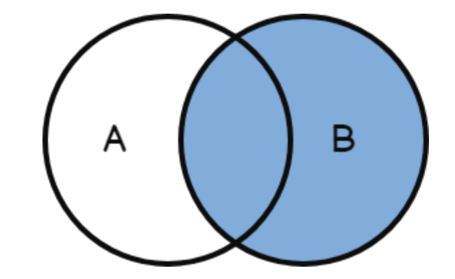

# Cuestionario

1. **¿A qué se denomina JOIN en una base de datos?**
Comando que nos permite combinar las columnas entre dos o más tablas en una base de datos relacions y retorna un conjunto de datos.

2. **Nombre y explique 2 tipos de JOIN**
    * **Left Join:** Devuelve todas las filas de la tabla 1, y las filas coincidentes de la tabla 2.
    
    * **Rigth Join:** Devuelve todas las filas de la tabla 2, y las  filas coincidente de la tabla 1.
    

3. **¿Para qué se utiliza el GROUP BY?**
Identifica una columna especificada como referencia para agrupar los resultados de la consulta. Divide los datos en grupos con el mismo valor en dicha columna y devulve una fila de cada grupo. Cuando se mencionan varias columnas en la cláusula GROUP BY, se produce una fila nueva en el informe cada vez que cambia un valor enuna de las columnas. EL valor nulo se trata como un grupo separado que consta de un miembro.

4. **¿Para qué se utiliza el HAVING?**
Elimina de los resultados datos no deseados, segun la condición especificada. Having solo puede ser usado con GROUP BY, SUBQUERIES o Funciones de Agregación.